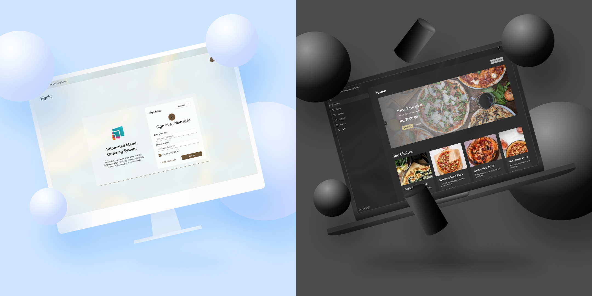

#  Automated Menu Ordering System



## Table of Contents

- [Introduction](#introduction)
- [Features](#features)
- [Technologies](#technologies)
  - [Frontend](#frontend)
  - [Backend](#backend)
- [Installation](#installation)
  - [Prerequisites](#prerequisites)
    - [Visual Studio 2022](#visual-studio-2022)
    - [Nuget Package Manager](#nuget-package-manager)
  - [Setting up workspace](#setting-up-workspace)
- [License](#license)

## Introduction

The Automated Menu Ordering System solves issues like long wait times, order mistakes, and reliance on waitstaff by allowing customers to select tables, browse menus, and place orders directly from a table screen. Customer can pay for their food. A manager oversees order fulfillment and overall restaurant operations, while an admin manages the menu, promotional deals, accounts, and branches.

## Features

- **User Authentication:** Secure login and signup for customers and administrators.
- **Dynamic Menu Management:** Admins can easily manage menu items, including names, prices, and descriptions.
- **Order Customization:** Customers can modify their orders with various options like sizes, toppings, and special requests.
- **Order History:** Customers can view past orders and repeat them if needed.
- **Order Tracking:** Customers can track the status of their order, from preparation to delivery.

## Technologies

The Automated Menu Ordering System is built with the following technologies:

### Frontend

- WinUI 3 (for building modern Windows desktop applications)
- XAML (for designing the user interface)

### Backend

- .NET 8 (for building the backend services)
- C# (for writing the application logic)
- PostgreSQL (for managing and storing data)

## Installation

### Prerequisites

Make sure you have the following installed:

#### Visual Studio 2022

- .NET desktop development workload
- Windows application development workload

#### Nuget Package Manager

- Npgsql
- EnvDotNet

### Setting up workspace

1. Clone the repository:

   ```bash
   git clone https://github.com/abdbbdii/Automated-Menu-Ordering-System
   ```

2. Open the solution file in Visual Studio 2022:

   ```bash
   cd Automated-Menu-Ordering-System/src/
   start Automated_Menu_Ordering_System.sln
   ```

3. Restore the NuGet packages:

   - Right-click on the solution in the Solution Explorer.
   - Select **Restore NuGet Packages**.

4. Set up the environment variables:

   - Create a new file named `.env` in the `Automated-Menu-Ordering-System/src/` directory and add the following environment variables:

   ```bash
   DATABASE_CONNECTION='Host=localhost;Port=5432;Username=postgres;Password=your_password;Database=your_database;'
   ```

   _Replace parameters with your PostgreSQL database credentials._

5. Build the solution:

   - Right-click on the solution in the Solution Explorer.
   - Select **Build Solution**.

6. Run the application:

   - Press `F5` to start the application in debug mode.

## License

This project is licensed under the MIT License - see the [LICENSE](LICENSE) file for details.
