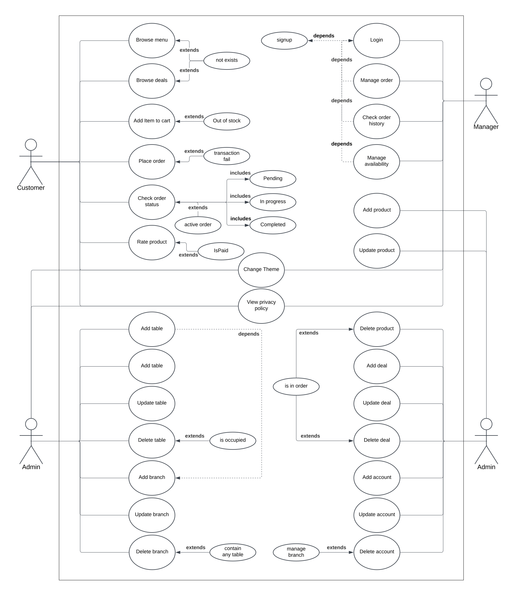
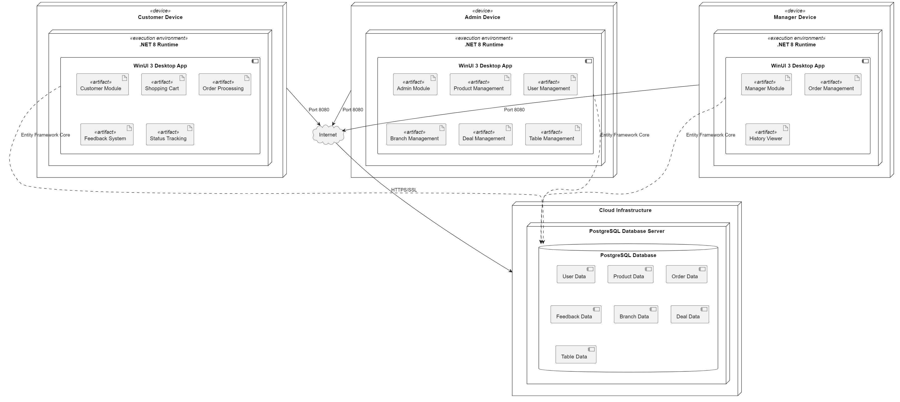
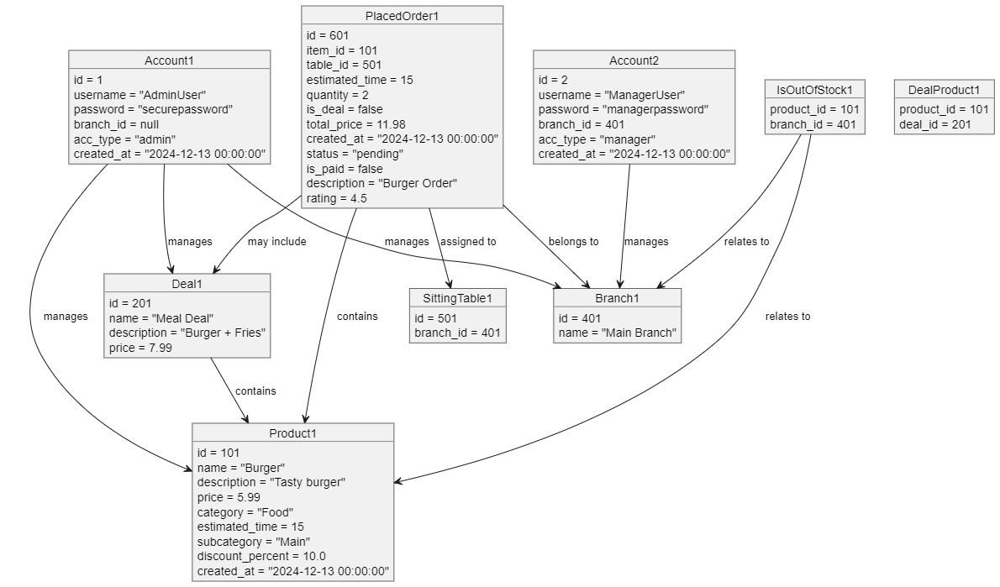
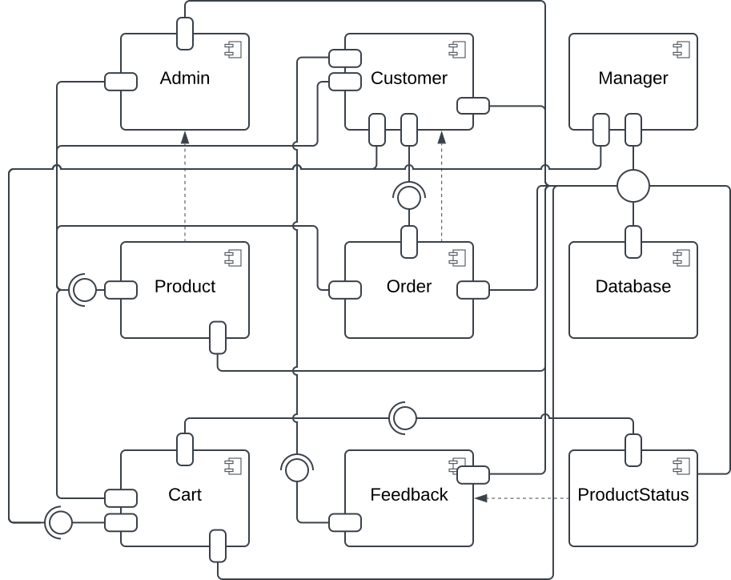
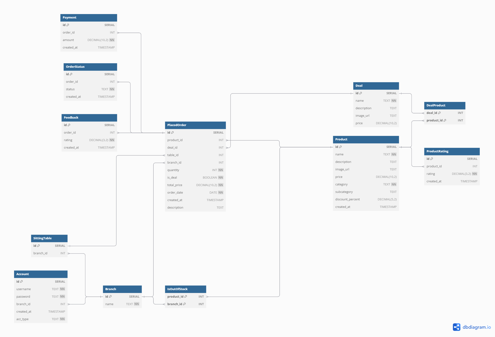

## Use Case Diagram

## Class Diagram

## Deployment Diagram

## Sequence Diagrams

### User: Admin

#### Login

#### Logout

#### Manage User Accounts

#### Manage Manage Branches

#### Manage Manage Menu

#### Manage Deals and Promotions

### User: Manager

#### Login

#### Logout

#### Manage Availability

#### Manage Orders

#### View Order History

### User: Customer

#### Browse Menu

#### Browse Deals and Promotion

#### Add Item to Cart

#### Place Order

#### View Order Status

#### Give Feedback

## Package Diagram

## Collaboration Diagrams

### User: Admin

#### Login

#### Logout

#### Manage User Accounts

#### Manage Branches

#### Manage Table Assignments

#### Manage Menu

#### Manage Deals and Promotions

### User: Manager

#### Login

#### Logout

#### Manage Availability

#### Manage Orders

#### View Order History

### User: Customer

#### Browse Menu

#### Browse Deals and Promotion

#### Add Item to Cart

#### Place Order

#### View Order Status

#### Give Feedback

## Activity Diagrams

### User: Admin

#### Login

#### Logout

#### Account Management

#### Branch Management

#### Table Assignment

#### Menu Management

#### Deals and Promotions Management

#### View Privacy Policy

### User: Manager

#### Login

#### Logout

#### Manage Availability

#### Manage Orders

#### View Order History

### User: Customer

#### Browse Menu

#### Browse Deals and Promotions

#### Add to Cart

#### Place Order

#### View Order Status

#### Provide Feedback

#### Logout

## Object Diagram

## State Diagrams

### User: Admin

### User: Manager

### User: Customer

## Component Diagram

## ER Diagram

